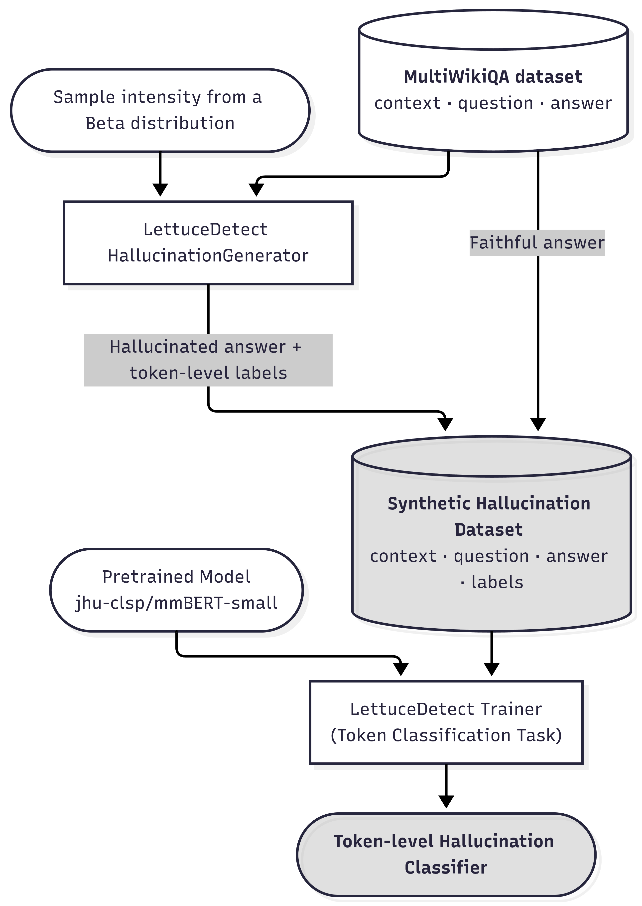

# Faithful Evaluation of LLMs

______________________________________________________________________
[](https://github.com/alexandrainst/factuality_eval/tree/main/tests)
[](https://alexandrainst.github.io/factuality_eval)
[](https://github.com/alexandrainst/factuality_eval/blob/main/LICENSE)
[](https://github.com/alexandrainst/factuality_eval/commits/main)
[](https://github.com/alexandrainst/factuality_eval/blob/main/CODE_OF_CONDUCT.md)

This repository contains tools for evaluating factuality and hallucination
behaviour in large language models. The current focus is a multilingual
token-level hallucination detector trained with LettuceDetect on synthetic
MultiWikiQA hallucinations, optionally mixed with translated RAGTruth examples.

The project supports three main workflows:

- Generate synthetic hallucination-labelled QA data.
- Fine-tune a token-classification model to detect hallucinated spans.
- Generate answers from an evaluation model and estimate hallucination rates.

## Training Pipeline

The detector is trained as a token-classification model. MultiWikiQA question-answer
pairs are split into faithful and hallucinated examples. The hallucinated examples
are created with LettuceDetect's `HallucinationGenerator`, using hallucination
intensities sampled from a clipped Beta distribution. The resulting token-level
labels are used to fine-tune `jhu-clsp/mmBERT-small` with LettuceDetect's trainer.

Translated RAGTruth data can be added to the training mix with the Hydra config
flags `ragtruth.enable` and `multiwikiqa.enable`.



Background reading and design notes are kept separately in
[`research/README.md`](research/README.md).

## Installation

The project uses Python 3.11 and `uv` for dependency management.

```bash
make install
```

After installation, activate the virtual environment:

```bash
source .venv/bin/activate
```

If you only need to install dependencies without the interactive setup, run:

```bash
uv sync --all-extras --python 3.11
```

Some workflows need external credentials:

- Set `OPENAI_API_KEY` when using OpenAI-backed generation models such as
  `gpt-5-mini` or `openai/<model-name>`.
- Log in to Hugging Face with `huggingface-cli login` when loading private
  datasets/models or pushing generated datasets and checkpoints.

## Configuration

The main Hydra config is [`config/hallucination_detection.yaml`](config/hallucination_detection.yaml).
Important settings include:

- `language`: target language code, for example `da`, `en`, or `de`.
- `base_dataset`: the Hugging Face QA dataset and field names.
- `models.hallu_gen_model`: model used to generate synthetic hallucinations.
- `models.pretrained_model`: base encoder used for token classification.
- `models.eval_model`: model whose answers should be evaluated.
- `ragtruth.enable` and `multiwikiqa.enable`: training data sources.
- `training`: output directory, batch size, epochs, learning rate, and hub upload settings.
- `generation.max_examples`: maximum number of examples to generate or evaluate.

Hydra values can be overridden from the command line:

```bash
uv run src/scripts/train_hallucination_detector.py language=en training.epochs=3 testing=true
```

## Common Workflows

Generate a synthetic hallucination dataset and push it to the configured Hugging
Face Hub repository:

```bash
uv run src/scripts/generate_dataset.py language=da
```

Train or evaluate the hallucination detector:

```bash
uv run src/scripts/train_hallucination_detector.py language=da
```

Run the detector on gold answers to establish a baseline hallucination rate:

```bash
uv run src/scripts/baseline.py language=da
```

Generate answers from `models.eval_model` and evaluate them with the trained
hallucination detector:

```bash
uv run src/scripts/detect_hallucinations.py language=da models.eval_model=Qwen/Qwen3-0.6B
```

Generate a JSONL dataset containing generated answers and hallucinated token spans:

```bash
uv run src/scripts/ground_truth/generate_hallucination_dataset.py language=da models.eval_model=Qwen/Qwen3-0.6B
```

Evaluate a trained hallucination detector against token-level ground-truth labels:

```bash
uv run src/scripts/ground_truth/evaluate_against_ground_truth.py language=da
```

## Data and Outputs

Generated files are written under `data/` when the relevant workflow is run. Common
outputs include:

- `data/final/*`: generated QA answers and hallucination-labelled JSONL files.
- `models/*`: locally trained hallucination detector checkpoints.
- Hydra run directories and logs for script executions.

Large generated datasets, model checkpoints, and local run outputs are not intended
to be edited by hand.

## Development

Run the test suite:

```bash
make test
```

Run linting, formatting, and type checks:

```bash
make check
```

Serve the documentation locally:

```bash
make docs
```

## Project Structure

- `config/`: Hydra configuration.
- `src/factuality_eval/`: reusable dataset generation, model generation, training,
  prompt, and hallucination-detection utilities.
- `src/scripts/`: executable workflows.
- `src/prompts/`: language-specific QA prompt templates.
- `tests/`: automated tests.
- `research/`: background notes and literature references.
- `models/`: local model checkpoints.

## Ground-Truth Evaluation Conclusion

On the current human-annotated set (185 rows), the trained detector and the
LLM judge show different trade-offs. The detector aligns better with human token
labels overall (token-level kappa 0.420 vs 0.288) and achieves higher token F1
than the LLM judge (0.448 vs 0.334). The LLM judge, however, runs with very high
recall and reaches better example-level and span-overlap F1, indicating that it
flags most hallucinations but with more false positives.

| Metric (annotated set, n=185) | detector | llm judge |
| --- | ---: | ---: |
| Token Precision | 0.371 | 0.206 |
| Token Recall | 0.564 | 0.887 |
| Token F1 | 0.448 | 0.334 |
| Span F1 (char-overlap) | 0.309 | 0.407 |
| Example F1 (any-token) | 0.364 | 0.544 |
| Token-level Cohen's kappa vs human | 0.420 | 0.288 |

Performance also depends on source data: the detector is much stronger on
RAGTruth-derived examples, while the LLM judge is stronger on MultiWikiQA-derived
examples. In practice, this suggests using the detector when precise token-level
agreement with human annotations is the primary goal, and using the LLM judge
when high-recall screening is preferred. For the full breakdown (including CIs
and per-source metrics), see [`analysis/human_evaluation.md`](analysis/human_evaluation.md).

## Danish Setup Comparison: Wiki vs RAGTruth

Recent Danish experiments compare three training regimes:

- Wiki + RAGTruth (synthetic MultiWikiQA + translated RAGTruth)
- Wiki only (synthetic MultiWikiQA)
- RAGTruth only (translated RAGTruth)

The table below summarizes the reported detector results from the runs on
2026-05-20 (plus the corresponding RAGTruth-only final checkpoint evaluation):

| Setup | Train/Test size after filtering | Token P/R/F1 | Token AUROC | Example P/R/F1 | Example AUROC | Span P/R/F1 |
| --- | --- | --- | --- | --- | --- | --- |
| Wiki + RAGTruth | 21187 / 4243 | 0.695 / 0.590 / 0.638 | 0.787 | 0.868 / 0.821 / 0.844 | 0.942 | 0.649 / 0.536 / 0.587 |
| Wiki only | 6245 / 1565 | 0.832 / 0.943 / 0.884 | 0.882 | 0.981 / 0.994 / 0.987 | 0.995 | 0.795 / 0.918 / 0.852 |
| RAGTruth only | 14942 / 2678 | 0.607 / 0.436 / 0.507 | 0.712 | 0.743 / 0.727 / 0.735 | 0.868 | 0.584 / 0.434 / 0.498 |

Key observations:

- Wiki-only is strongest on its own synthetic-style evaluation split, with the
  highest token/example/span scores.
- Adding RAGTruth increases dataset diversity and improves human-alignment on
  RAGTruth-like examples, but lowers aggregate benchmark scores on the mixed
  test set relative to wiki-only.
- RAGTruth-only is the hardest setting for this model family: high precision on
  supported tokens remains, while hallucinated-token recall drops.
- The setups are not strictly apples-to-apples: each model is evaluated on a
  different test distribution and class balance. Use this comparison to read
  trade-offs, not as a single absolute ranking.
- The highest correlation with human-annotated datasets was achieved by including the RAGTruth dataset.
